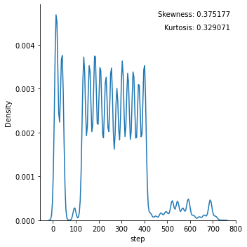
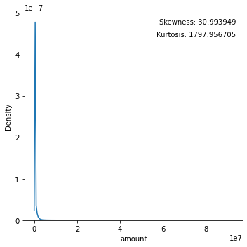
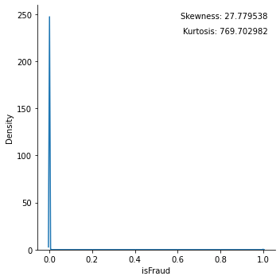
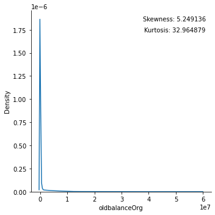
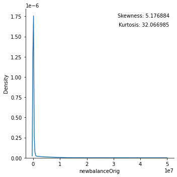
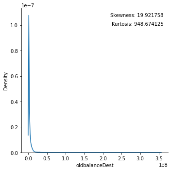

# Loading the libraries

First we will load some basic libraries for our purposes


```python
import pandas as pd 
import numpy as np 
import matplotlib.gridspec as gridspec
import seaborn as sns
import matplotlib.pyplot as plt 
import warnings

from sklearn.preprocessing import LabelEncoder, OrdinalEncoder
from sklearn.preprocessing import OneHotEncoder
from sklearn.preprocessing import PowerTransformer, StandardScaler,Normalizer,RobustScaler,MaxAbsScaler,MinMaxScaler,QuantileTransformer
from sklearn.preprocessing import FunctionTransformer
from sklearn.preprocessing import PolynomialFeatures
from sklearn.neighbors import KNeighborsClassifier
from sklearn.preprocessing import KBinsDiscretizer
from sklearn.model_selection import train_test_split
from sklearn.linear_model import LogisticRegression
```

# Loading the dataset from the system


```python
df=pd.read_csv('C:\\Users\\Shashwat Saket\\Downloads\\Fraud.csv')
```

# Performing EDA


```python
df.head()
```


<div>
<style scoped>
    .dataframe tbody tr th:only-of-type {
        vertical-align: middle;
    }

    .dataframe tbody tr th {
        vertical-align: top;
    }

    .dataframe thead th {
        text-align: right;
    }
</style>
<table border="1" class="dataframe">
  <thead>
    <tr style="text-align: right;">
      <th></th>
      <th>step</th>
      <th>type</th>
      <th>amount</th>
      <th>nameOrig</th>
      <th>oldbalanceOrg</th>
      <th>newbalanceOrig</th>
      <th>nameDest</th>
      <th>oldbalanceDest</th>
      <th>newbalanceDest</th>
      <th>isFraud</th>
      <th>isFlaggedFraud</th>
    </tr>
  </thead>
  <tbody>
    <tr>
      <th>0</th>
      <td>1</td>
      <td>PAYMENT</td>
      <td>9839.64</td>
      <td>C1231006815</td>
      <td>170136.0</td>
      <td>160296.36</td>
      <td>M1979787155</td>
      <td>0.0</td>
      <td>0.0</td>
      <td>0</td>
      <td>0</td>
    </tr>
    <tr>
      <th>1</th>
      <td>1</td>
      <td>PAYMENT</td>
      <td>1864.28</td>
      <td>C1666544295</td>
      <td>21249.0</td>
      <td>19384.72</td>
      <td>M2044282225</td>
      <td>0.0</td>
      <td>0.0</td>
      <td>0</td>
      <td>0</td>
    </tr>
    <tr>
      <th>2</th>
      <td>1</td>
      <td>TRANSFER</td>
      <td>181.00</td>
      <td>C1305486145</td>
      <td>181.0</td>
      <td>0.00</td>
      <td>C553264065</td>
      <td>0.0</td>
      <td>0.0</td>
      <td>1</td>
      <td>0</td>
    </tr>
    <tr>
      <th>3</th>
      <td>1</td>
      <td>CASH_OUT</td>
      <td>181.00</td>
      <td>C840083671</td>
      <td>181.0</td>
      <td>0.00</td>
      <td>C38997010</td>
      <td>21182.0</td>
      <td>0.0</td>
      <td>1</td>
      <td>0</td>
    </tr>
    <tr>
      <th>4</th>
      <td>1</td>
      <td>PAYMENT</td>
      <td>11668.14</td>
      <td>C2048537720</td>
      <td>41554.0</td>
      <td>29885.86</td>
      <td>M1230701703</td>
      <td>0.0</td>
      <td>0.0</td>
      <td>0</td>
      <td>0</td>
    </tr>
  </tbody>
</table>
</div>


```python
df.describe()
```


<div>
<style scoped>
    .dataframe tbody tr th:only-of-type {
        vertical-align: middle;
    }

    .dataframe tbody tr th {
        vertical-align: top;
    }

    .dataframe thead th {
        text-align: right;
    }
</style>
<table border="1" class="dataframe">
  <thead>
    <tr style="text-align: right;">
      <th></th>
      <th>step</th>
      <th>amount</th>
      <th>oldbalanceOrg</th>
      <th>newbalanceOrig</th>
      <th>oldbalanceDest</th>
      <th>newbalanceDest</th>
      <th>isFraud</th>
      <th>isFlaggedFraud</th>
    </tr>
  </thead>
  <tbody>
    <tr>
      <th>count</th>
      <td>6.362620e+06</td>
      <td>6.362620e+06</td>
      <td>6.362620e+06</td>
      <td>6.362620e+06</td>
      <td>6.362620e+06</td>
      <td>6.362620e+06</td>
      <td>6.362620e+06</td>
      <td>6.362620e+06</td>
    </tr>
    <tr>
      <th>mean</th>
      <td>2.433972e+02</td>
      <td>1.798619e+05</td>
      <td>8.338831e+05</td>
      <td>8.551137e+05</td>
      <td>1.100702e+06</td>
      <td>1.224996e+06</td>
      <td>1.290820e-03</td>
      <td>2.514687e-06</td>
    </tr>
    <tr>
      <th>std</th>
      <td>1.423320e+02</td>
      <td>6.038582e+05</td>
      <td>2.888243e+06</td>
      <td>2.924049e+06</td>
      <td>3.399180e+06</td>
      <td>3.674129e+06</td>
      <td>3.590480e-02</td>
      <td>1.585775e-03</td>
    </tr>
    <tr>
      <th>min</th>
      <td>1.000000e+00</td>
      <td>0.000000e+00</td>
      <td>0.000000e+00</td>
      <td>0.000000e+00</td>
      <td>0.000000e+00</td>
      <td>0.000000e+00</td>
      <td>0.000000e+00</td>
      <td>0.000000e+00</td>
    </tr>
    <tr>
      <th>25%</th>
      <td>1.560000e+02</td>
      <td>1.338957e+04</td>
      <td>0.000000e+00</td>
      <td>0.000000e+00</td>
      <td>0.000000e+00</td>
      <td>0.000000e+00</td>
      <td>0.000000e+00</td>
      <td>0.000000e+00</td>
    </tr>
    <tr>
      <th>50%</th>
      <td>2.390000e+02</td>
      <td>7.487194e+04</td>
      <td>1.420800e+04</td>
      <td>0.000000e+00</td>
      <td>1.327057e+05</td>
      <td>2.146614e+05</td>
      <td>0.000000e+00</td>
      <td>0.000000e+00</td>
    </tr>
    <tr>
      <th>75%</th>
      <td>3.350000e+02</td>
      <td>2.087215e+05</td>
      <td>1.073152e+05</td>
      <td>1.442584e+05</td>
      <td>9.430367e+05</td>
      <td>1.111909e+06</td>
      <td>0.000000e+00</td>
      <td>0.000000e+00</td>
    </tr>
    <tr>
      <th>max</th>
      <td>7.430000e+02</td>
      <td>9.244552e+07</td>
      <td>5.958504e+07</td>
      <td>4.958504e+07</td>
      <td>3.560159e+08</td>
      <td>3.561793e+08</td>
      <td>1.000000e+00</td>
      <td>1.000000e+00</td>
    </tr>
  </tbody>
</table>
</div>


```python
df.columns

```


    Index(['step', 'type', 'amount', 'nameOrig', 'oldbalanceOrg', 'newbalanceOrig',
           'nameDest', 'oldbalanceDest', 'newbalanceDest', 'isFraud',
           'isFlaggedFraud'],
          dtype='object')


```python
df.isnull().sum().values
```


    array([0, 0, 0, 0, 0, 0, 0, 0, 0, 0, 0], dtype=int64)


```python
df.shape
```


    (6362620, 11)


```python
graph=['step','amount','isFraud', 'oldbalanceOrg', 'newbalanceOrig','oldbalanceDest', 'newbalanceDest']
for i in graph:
    g = sns.displot(data=df, x=df[i],kind ='kde')
    for ax in g.axes.ravel():
            ax.text(x=0.97, y=0.97, transform=ax.transAxes, s="Skewness: %f" % df[i].skew(),\
                fontsize=10, verticalalignment='top', horizontalalignment='right')
            ax.text(x=0.97, y=0.91, transform=ax.transAxes, s="Kurtosis: %f" % df[i].kurt(),\
                fontsize=10, verticalalignment='top', horizontalalignment='right')
    
    
```


    

    


    

    


    

    


    

    


    

    


    

    


    

    


 ## Analysing the skewness and kurtosis

### This demonstrates a very high skewness and kurtosis so we can remove it using log transform later


```python
label= "isFraud"
X = df.drop(label, axis='columns')
y = df[label].to_numpy()
```


```python
X
```


<div>
<style scoped>
    .dataframe tbody tr th:only-of-type {
        vertical-align: middle;
    }

    .dataframe tbody tr th {
        vertical-align: top;
    }

    .dataframe thead th {
        text-align: right;
    }
</style>
<table border="1" class="dataframe">
  <thead>
    <tr style="text-align: right;">
      <th></th>
      <th>step</th>
      <th>type</th>
      <th>amount</th>
      <th>nameOrig</th>
      <th>oldbalanceOrg</th>
      <th>newbalanceOrig</th>
      <th>nameDest</th>
      <th>oldbalanceDest</th>
      <th>newbalanceDest</th>
      <th>isFlaggedFraud</th>
    </tr>
  </thead>
  <tbody>
    <tr>
      <th>0</th>
      <td>1</td>
      <td>PAYMENT</td>
      <td>9839.64</td>
      <td>C1231006815</td>
      <td>170136.00</td>
      <td>160296.36</td>
      <td>M1979787155</td>
      <td>0.00</td>
      <td>0.00</td>
      <td>0</td>
    </tr>
    <tr>
      <th>1</th>
      <td>1</td>
      <td>PAYMENT</td>
      <td>1864.28</td>
      <td>C1666544295</td>
      <td>21249.00</td>
      <td>19384.72</td>
      <td>M2044282225</td>
      <td>0.00</td>
      <td>0.00</td>
      <td>0</td>
    </tr>
    <tr>
      <th>2</th>
      <td>1</td>
      <td>TRANSFER</td>
      <td>181.00</td>
      <td>C1305486145</td>
      <td>181.00</td>
      <td>0.00</td>
      <td>C553264065</td>
      <td>0.00</td>
      <td>0.00</td>
      <td>0</td>
    </tr>
    <tr>
      <th>3</th>
      <td>1</td>
      <td>CASH_OUT</td>
      <td>181.00</td>
      <td>C840083671</td>
      <td>181.00</td>
      <td>0.00</td>
      <td>C38997010</td>
      <td>21182.00</td>
      <td>0.00</td>
      <td>0</td>
    </tr>
    <tr>
      <th>4</th>
      <td>1</td>
      <td>PAYMENT</td>
      <td>11668.14</td>
      <td>C2048537720</td>
      <td>41554.00</td>
      <td>29885.86</td>
      <td>M1230701703</td>
      <td>0.00</td>
      <td>0.00</td>
      <td>0</td>
    </tr>
    <tr>
      <th>...</th>
      <td>...</td>
      <td>...</td>
      <td>...</td>
      <td>...</td>
      <td>...</td>
      <td>...</td>
      <td>...</td>
      <td>...</td>
      <td>...</td>
      <td>...</td>
    </tr>
    <tr>
      <th>6362615</th>
      <td>743</td>
      <td>CASH_OUT</td>
      <td>339682.13</td>
      <td>C786484425</td>
      <td>339682.13</td>
      <td>0.00</td>
      <td>C776919290</td>
      <td>0.00</td>
      <td>339682.13</td>
      <td>0</td>
    </tr>
    <tr>
      <th>6362616</th>
      <td>743</td>
      <td>TRANSFER</td>
      <td>6311409.28</td>
      <td>C1529008245</td>
      <td>6311409.28</td>
      <td>0.00</td>
      <td>C1881841831</td>
      <td>0.00</td>
      <td>0.00</td>
      <td>0</td>
    </tr>
    <tr>
      <th>6362617</th>
      <td>743</td>
      <td>CASH_OUT</td>
      <td>6311409.28</td>
      <td>C1162922333</td>
      <td>6311409.28</td>
      <td>0.00</td>
      <td>C1365125890</td>
      <td>68488.84</td>
      <td>6379898.11</td>
      <td>0</td>
    </tr>
    <tr>
      <th>6362618</th>
      <td>743</td>
      <td>TRANSFER</td>
      <td>850002.52</td>
      <td>C1685995037</td>
      <td>850002.52</td>
      <td>0.00</td>
      <td>C2080388513</td>
      <td>0.00</td>
      <td>0.00</td>
      <td>0</td>
    </tr>
    <tr>
      <th>6362619</th>
      <td>743</td>
      <td>CASH_OUT</td>
      <td>850002.52</td>
      <td>C1280323807</td>
      <td>850002.52</td>
      <td>0.00</td>
      <td>C873221189</td>
      <td>6510099.11</td>
      <td>7360101.63</td>
      <td>0</td>
    </tr>
  </tbody>
</table>
<p>6362620 rows × 10 columns</p>
</div>


```python
col=['type','amount','oldbalanceOrg','newbalanceOrig','oldbalanceDest','newbalanceDest']
col2=['amount','oldbalanceOrg','newbalanceOrig','oldbalanceDest','newbalanceDest']
```


```python
X_train,X_test,y_train,y_test=train_test_split(X,y,stratify=y)
```


```python
X_new=X_train[col2]
```


```python
X_new=StandardScaler().fit_transform(X_new)
```


```python
drop_X_train = X.select_dtypes(exclude=['object'])
```


```python
drop_X_train
```


<div>
<style scoped>
    .dataframe tbody tr th:only-of-type {
        vertical-align: middle;
    }

    .dataframe tbody tr th {
        vertical-align: top;
    }

    .dataframe thead th {
        text-align: right;
    }
</style>
<table border="1" class="dataframe">
  <thead>
    <tr style="text-align: right;">
      <th></th>
      <th>step</th>
      <th>amount</th>
      <th>oldbalanceOrg</th>
      <th>newbalanceOrig</th>
      <th>oldbalanceDest</th>
      <th>newbalanceDest</th>
      <th>isFlaggedFraud</th>
    </tr>
  </thead>
  <tbody>
    <tr>
      <th>0</th>
      <td>1</td>
      <td>9839.64</td>
      <td>170136.00</td>
      <td>160296.36</td>
      <td>0.00</td>
      <td>0.00</td>
      <td>0</td>
    </tr>
    <tr>
      <th>1</th>
      <td>1</td>
      <td>1864.28</td>
      <td>21249.00</td>
      <td>19384.72</td>
      <td>0.00</td>
      <td>0.00</td>
      <td>0</td>
    </tr>
    <tr>
      <th>2</th>
      <td>1</td>
      <td>181.00</td>
      <td>181.00</td>
      <td>0.00</td>
      <td>0.00</td>
      <td>0.00</td>
      <td>0</td>
    </tr>
    <tr>
      <th>3</th>
      <td>1</td>
      <td>181.00</td>
      <td>181.00</td>
      <td>0.00</td>
      <td>21182.00</td>
      <td>0.00</td>
      <td>0</td>
    </tr>
    <tr>
      <th>4</th>
      <td>1</td>
      <td>11668.14</td>
      <td>41554.00</td>
      <td>29885.86</td>
      <td>0.00</td>
      <td>0.00</td>
      <td>0</td>
    </tr>
    <tr>
      <th>...</th>
      <td>...</td>
      <td>...</td>
      <td>...</td>
      <td>...</td>
      <td>...</td>
      <td>...</td>
      <td>...</td>
    </tr>
    <tr>
      <th>6362615</th>
      <td>743</td>
      <td>339682.13</td>
      <td>339682.13</td>
      <td>0.00</td>
      <td>0.00</td>
      <td>339682.13</td>
      <td>0</td>
    </tr>
    <tr>
      <th>6362616</th>
      <td>743</td>
      <td>6311409.28</td>
      <td>6311409.28</td>
      <td>0.00</td>
      <td>0.00</td>
      <td>0.00</td>
      <td>0</td>
    </tr>
    <tr>
      <th>6362617</th>
      <td>743</td>
      <td>6311409.28</td>
      <td>6311409.28</td>
      <td>0.00</td>
      <td>68488.84</td>
      <td>6379898.11</td>
      <td>0</td>
    </tr>
    <tr>
      <th>6362618</th>
      <td>743</td>
      <td>850002.52</td>
      <td>850002.52</td>
      <td>0.00</td>
      <td>0.00</td>
      <td>0.00</td>
      <td>0</td>
    </tr>
    <tr>
      <th>6362619</th>
      <td>743</td>
      <td>850002.52</td>
      <td>850002.52</td>
      <td>0.00</td>
      <td>6510099.11</td>
      <td>7360101.63</td>
      <td>0</td>
    </tr>
  </tbody>
</table>
<p>6362620 rows × 7 columns</p>
</div>


```python
X['type'].unique()
```


    array(['PAYMENT', 'TRANSFER', 'CASH_OUT', 'DEBIT', 'CASH_IN'],
          dtype=object)


```python
object_cols = [col for col in df.columns if df[col].dtype == "object"]
```


```python
object_cols
```


    ['type', 'nameOrig', 'nameDest']


```python

```


```python
good_label_cols = [col for col in object_cols if 
                   set(X_train[col]) == set(X_test[col])]
```


```python
label_encoder=LabelEncoder()
X_train['type']=label_encoder.fit_transform(X_train['type'])
X_test['type']=label_encoder.fit_transform(X_test['type'])
```

    C:\Users\SHASHW~1\AppData\Local\Temp/ipykernel_7108/341610649.py:2: SettingWithCopyWarning: 
    A value is trying to be set on a copy of a slice from a DataFrame.
    Try using .loc[row_indexer,col_indexer] = value instead
    
    See the caveats in the documentation: https://pandas.pydata.org/pandas-docs/stable/user_guide/indexing.html#returning-a-view-versus-a-copy
      X_train['type']=label_encoder.fit_transform(X_train['type'])
    C:\Users\SHASHW~1\AppData\Local\Temp/ipykernel_7108/341610649.py:3: SettingWithCopyWarning: 
    A value is trying to be set on a copy of a slice from a DataFrame.
    Try using .loc[row_indexer,col_indexer] = value instead
    
    See the caveats in the documentation: https://pandas.pydata.org/pandas-docs/stable/user_guide/indexing.html#returning-a-view-versus-a-copy
      X_test['type']=label_encoder.fit_transform(X_test['type'])
    


```python
catcol=X_train['type']
```


```python
X_train_new=X_train[col]
X_test_new=X_test[col]
```


```python
catcol.shape
```


    (4771965,)


```python
X_train_new
```


<div>
<style scoped>
    .dataframe tbody tr th:only-of-type {
        vertical-align: middle;
    }

    .dataframe tbody tr th {
        vertical-align: top;
    }

    .dataframe thead th {
        text-align: right;
    }
</style>
<table border="1" class="dataframe">
  <thead>
    <tr style="text-align: right;">
      <th></th>
      <th>type</th>
      <th>amount</th>
      <th>oldbalanceOrg</th>
      <th>newbalanceOrig</th>
      <th>oldbalanceDest</th>
      <th>newbalanceDest</th>
    </tr>
  </thead>
  <tbody>
    <tr>
      <th>1521042</th>
      <td>0</td>
      <td>326041.32</td>
      <td>14703825.95</td>
      <td>15029867.26</td>
      <td>493495.76</td>
      <td>167454.45</td>
    </tr>
    <tr>
      <th>1074638</th>
      <td>1</td>
      <td>16093.87</td>
      <td>0.00</td>
      <td>0.00</td>
      <td>447802.91</td>
      <td>463896.78</td>
    </tr>
    <tr>
      <th>3455349</th>
      <td>1</td>
      <td>49301.07</td>
      <td>0.00</td>
      <td>0.00</td>
      <td>5356546.69</td>
      <td>5405847.76</td>
    </tr>
    <tr>
      <th>1414451</th>
      <td>1</td>
      <td>15723.78</td>
      <td>206059.87</td>
      <td>190336.10</td>
      <td>212319.65</td>
      <td>228043.43</td>
    </tr>
    <tr>
      <th>6267792</th>
      <td>1</td>
      <td>321965.50</td>
      <td>0.00</td>
      <td>0.00</td>
      <td>1792304.98</td>
      <td>2114270.49</td>
    </tr>
    <tr>
      <th>...</th>
      <td>...</td>
      <td>...</td>
      <td>...</td>
      <td>...</td>
      <td>...</td>
      <td>...</td>
    </tr>
    <tr>
      <th>2509086</th>
      <td>1</td>
      <td>97171.64</td>
      <td>0.00</td>
      <td>0.00</td>
      <td>876514.52</td>
      <td>973686.17</td>
    </tr>
    <tr>
      <th>4886085</th>
      <td>1</td>
      <td>143375.09</td>
      <td>0.00</td>
      <td>0.00</td>
      <td>256633.47</td>
      <td>400008.56</td>
    </tr>
    <tr>
      <th>2716271</th>
      <td>3</td>
      <td>1012.03</td>
      <td>21368.00</td>
      <td>20355.97</td>
      <td>0.00</td>
      <td>0.00</td>
    </tr>
    <tr>
      <th>5543719</th>
      <td>3</td>
      <td>9944.82</td>
      <td>12212.00</td>
      <td>2267.18</td>
      <td>0.00</td>
      <td>0.00</td>
    </tr>
    <tr>
      <th>3132777</th>
      <td>1</td>
      <td>459250.73</td>
      <td>0.00</td>
      <td>0.00</td>
      <td>1928380.92</td>
      <td>2548962.78</td>
    </tr>
  </tbody>
</table>
<p>4771965 rows × 6 columns</p>
</div>


```python
X_test_new
```


<div>
<style scoped>
    .dataframe tbody tr th:only-of-type {
        vertical-align: middle;
    }

    .dataframe tbody tr th {
        vertical-align: top;
    }

    .dataframe thead th {
        text-align: right;
    }
</style>
<table border="1" class="dataframe">
  <thead>
    <tr style="text-align: right;">
      <th></th>
      <th>type</th>
      <th>amount</th>
      <th>oldbalanceOrg</th>
      <th>newbalanceOrig</th>
      <th>oldbalanceDest</th>
      <th>newbalanceDest</th>
    </tr>
  </thead>
  <tbody>
    <tr>
      <th>5113549</th>
      <td>0</td>
      <td>284896.37</td>
      <td>5550390.96</td>
      <td>5835287.32</td>
      <td>1335474.91</td>
      <td>1050578.55</td>
    </tr>
    <tr>
      <th>5407182</th>
      <td>1</td>
      <td>9618.72</td>
      <td>2490.95</td>
      <td>0.00</td>
      <td>763957.30</td>
      <td>773576.03</td>
    </tr>
    <tr>
      <th>5970691</th>
      <td>1</td>
      <td>22480.43</td>
      <td>0.00</td>
      <td>0.00</td>
      <td>137403.79</td>
      <td>159884.22</td>
    </tr>
    <tr>
      <th>6131344</th>
      <td>0</td>
      <td>56403.97</td>
      <td>269445.00</td>
      <td>325848.97</td>
      <td>2928694.84</td>
      <td>2872290.88</td>
    </tr>
    <tr>
      <th>1081641</th>
      <td>0</td>
      <td>137060.58</td>
      <td>75503.00</td>
      <td>212563.58</td>
      <td>8367211.43</td>
      <td>8462201.26</td>
    </tr>
    <tr>
      <th>...</th>
      <td>...</td>
      <td>...</td>
      <td>...</td>
      <td>...</td>
      <td>...</td>
      <td>...</td>
    </tr>
    <tr>
      <th>3776993</th>
      <td>0</td>
      <td>123196.81</td>
      <td>10201.00</td>
      <td>133397.81</td>
      <td>165125.48</td>
      <td>41928.67</td>
    </tr>
    <tr>
      <th>6181371</th>
      <td>1</td>
      <td>374616.37</td>
      <td>504259.00</td>
      <td>129642.63</td>
      <td>634150.38</td>
      <td>1008766.76</td>
    </tr>
    <tr>
      <th>231565</th>
      <td>1</td>
      <td>182791.04</td>
      <td>25959.00</td>
      <td>0.00</td>
      <td>0.00</td>
      <td>182791.04</td>
    </tr>
    <tr>
      <th>80435</th>
      <td>4</td>
      <td>1236993.88</td>
      <td>0.00</td>
      <td>0.00</td>
      <td>1330123.54</td>
      <td>2321500.51</td>
    </tr>
    <tr>
      <th>3852408</th>
      <td>3</td>
      <td>5054.25</td>
      <td>0.00</td>
      <td>0.00</td>
      <td>0.00</td>
      <td>0.00</td>
    </tr>
  </tbody>
</table>
<p>1590655 rows × 6 columns</p>
</div>


```python
for i in X_train_new:
    X_train_new[i]=np.log(X_train_new[i]+1)


```

    C:\Users\SHASHW~1\AppData\Local\Temp/ipykernel_7108/3228474689.py:2: SettingWithCopyWarning: 
    A value is trying to be set on a copy of a slice from a DataFrame.
    Try using .loc[row_indexer,col_indexer] = value instead
    
    See the caveats in the documentation: https://pandas.pydata.org/pandas-docs/stable/user_guide/indexing.html#returning-a-view-versus-a-copy
      X_train_new[i]=np.log(X_train_new[i]+1)
    


```python
for i in X_test_new:
    X_test_new[i]=np.log(X_test_new[i]+1)
```

    C:\Users\SHASHW~1\AppData\Local\Temp/ipykernel_7108/2854076662.py:2: SettingWithCopyWarning: 
    A value is trying to be set on a copy of a slice from a DataFrame.
    Try using .loc[row_indexer,col_indexer] = value instead
    
    See the caveats in the documentation: https://pandas.pydata.org/pandas-docs/stable/user_guide/indexing.html#returning-a-view-versus-a-copy
      X_test_new[i]=np.log(X_test_new[i]+1)
    


```python
X_train_new.skew()
```


    type             -0.294838
    amount           -0.553923
    oldbalanceOrg    -0.260134
    newbalanceOrig    0.439752
    oldbalanceDest   -0.212621
    newbalanceDest   -0.386209
    dtype: float64


```python
X_Train=StandardScaler().fit_transform(X_train_new)
X_Test=StandardScaler().fit_transform(X_test_new)
```


```python
# Model training on some basic Classifiers
```


```python
model=LogisticRegression()
model.fit(X_Train,y_train)
```


    LogisticRegression()


```python
model.predict(X_Test)
```


    array([0, 0, 0, ..., 0, 0, 0], dtype=int64)


```python
model.score(X_Train,y_train)
```


    0.9993084609799108


```python
model.score(X_Test,y_test)
```


    0.9993040602770557


```python
from sklearn.svm import SVC
from sklearn.model_selection import GridSearchCV
```


```python
svc=SVC()
svc.fit(X_Train,y_train)
```


    SVC()


```python
# svr = SVC()
# svr_CV = GridSearchCV(svr, param_grid={'kernel': ['linear', 'poly', 'rbf', 'sigmoid'],
#                                        'tol': [1e-4]}, 
#                       cv=None, verbose=False)
# svr_CV.fit(X_Train, y_train)
# print(svr_CV.best_params_)
# acc_metrics_calc(1,svr_CV,X_Train,X_Test,y_train,y_test)
# (Would have gone with grid search for searching the best parameters.)
```


```python
from sklearn import metrics
preds = svc.predict(X_Train)
targs = y_train 
print("accuracy: ", metrics.accuracy_score(targs, preds))
print("precision: ", metrics.precision_score(targs, preds)) 
print("recall: ", metrics.recall_score(targs, preds))
print("f1: ", metrics.f1_score(targs, preds))
print("area under curve (auc): ", metrics.roc_auc_score(targs, preds))
train_preds = preds
```

    accuracy:  0.9995852861452252
    precision:  0.994792899408284
    recall:  0.6823051948051948
    f1:  0.8094366875300916
    area under curve (auc):  0.8411502892930546
    


```python

```


```python

```
